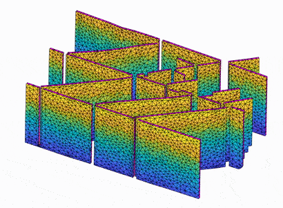
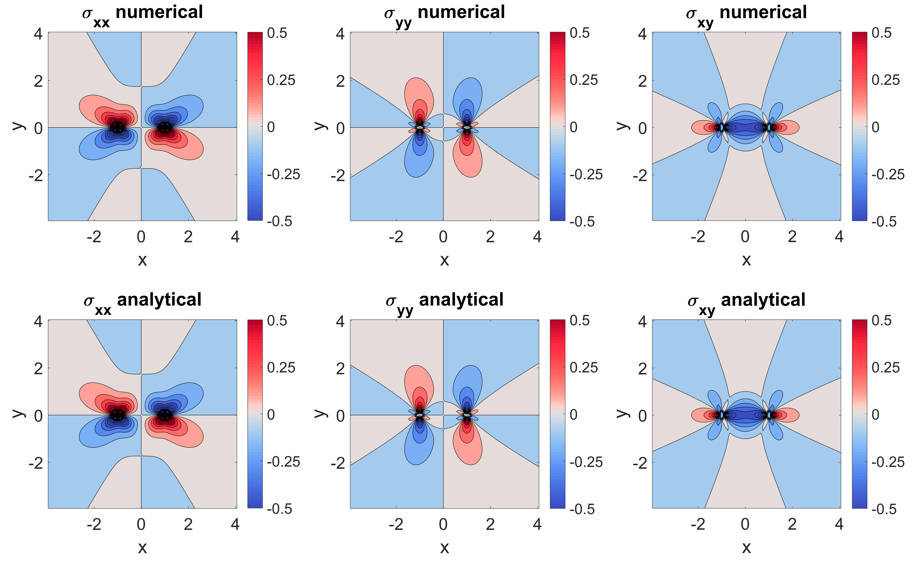
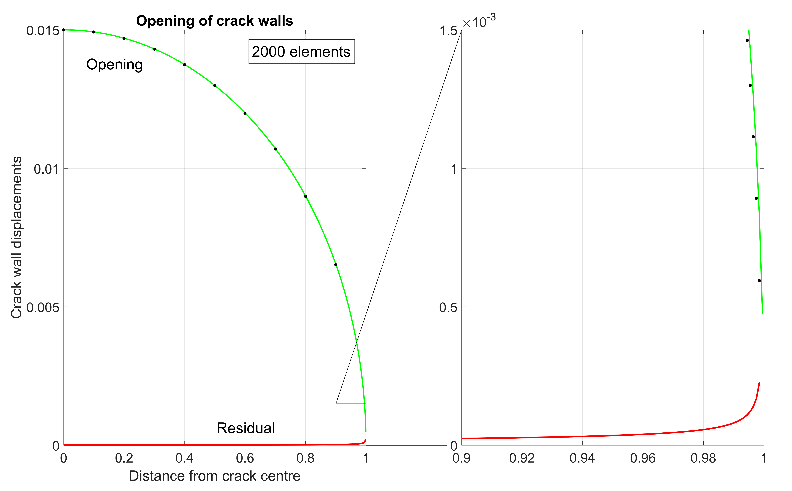
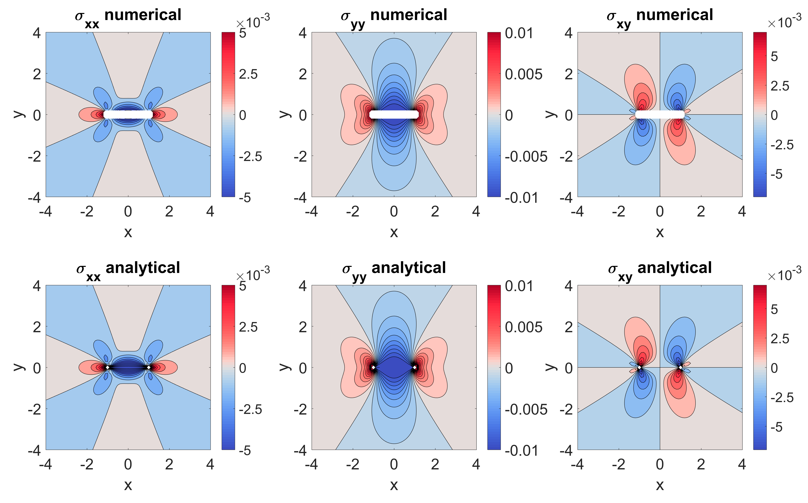
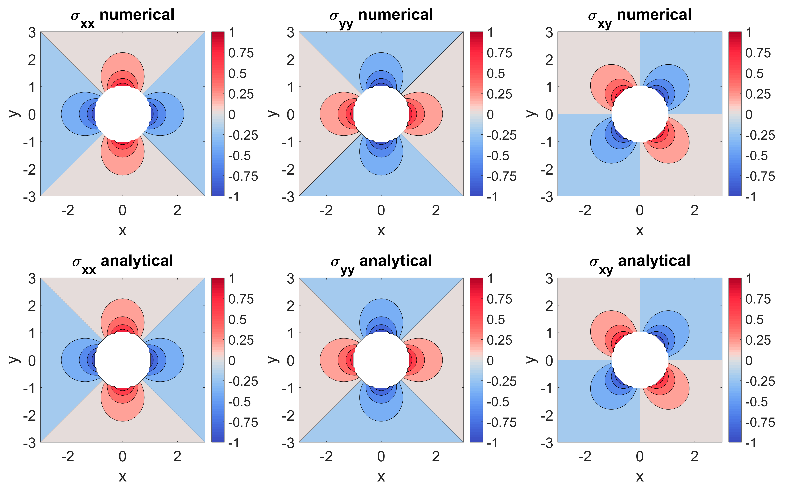
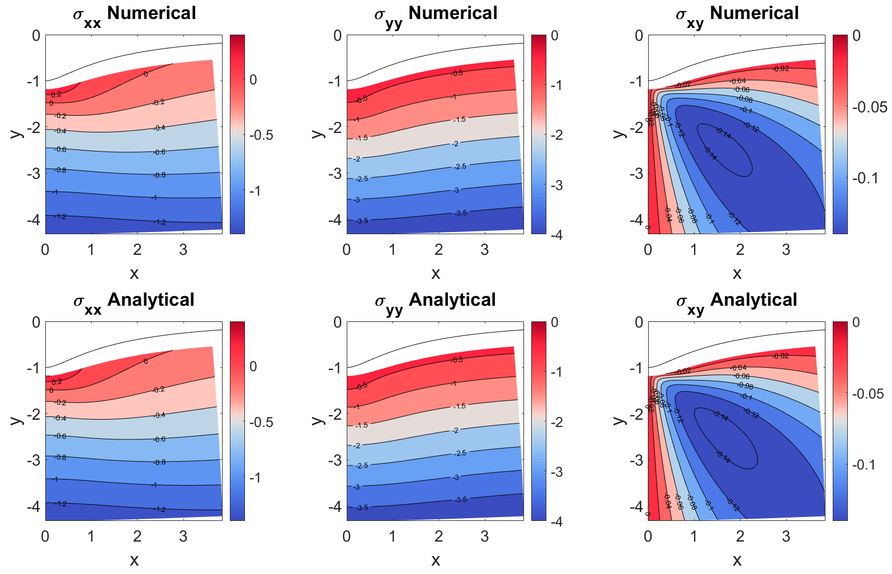
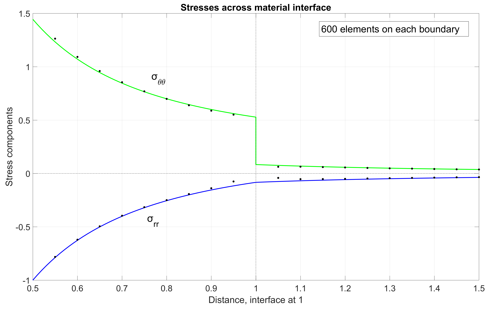
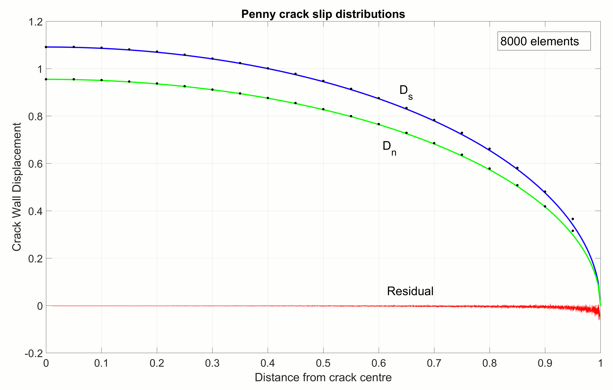
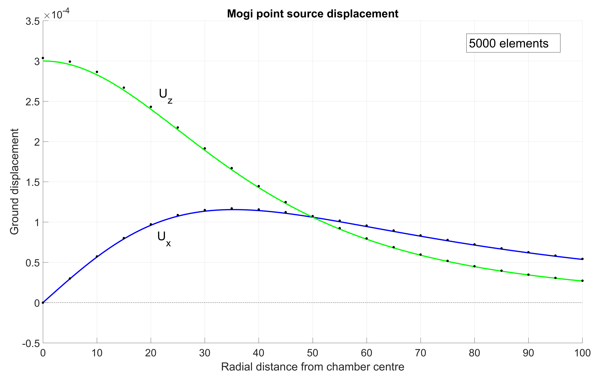
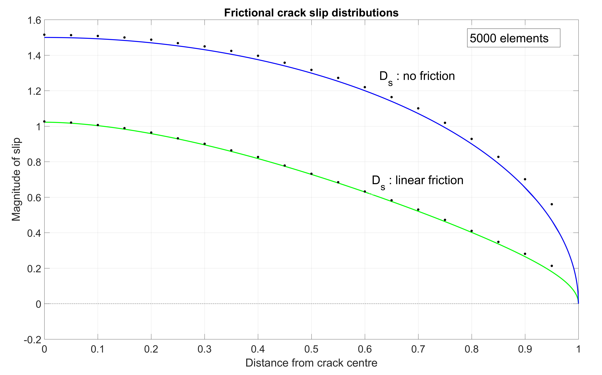

# CutAndDisplace

## Index
- [Introduction](#introduction)
- [1. How to run](#1-how-to-run)
- [2. Analytical tests](#2-analytical-tests)
    - [2.1. 2D Analytical tests](#21-2d-analytical-tests)
    - [2.2. 3D Analytical tests](#22-3d-analytical-tests)
- [3. Files and data format](#3-files-and-data-format)
    - [3.1. 2D files and data](#31-2d-files-and-data)
    - [3.2. 3D files and data](#32-3d-files-and-data)
    - [3.3. Code structure](#33-code-structure)	
- [4. Notation in Code](#4-notation-in-code)
    - [4.1. Basics](#41-basics)
    - [4.2. Tensors](#42-tensors)
    - [4.3. Vectors](#43-vectors)
    - [4.4. Matrices](#44-matrices)     
    - [4.5. Element Geometry](#45-element-geometry)    
    - [4.6. Flags](#46-flags)  
    - [4.7. Tables](#47-tables)    
- [5. Elements used in 2D and 3D](#5-elements-used-in-2d-and-3d)    
- [6. Code highlights and applications](#6-code-highlights-and-applications)  
- [7. Acknowledgements](#7-acknowledgements)  

  
Gif of a fault array shearing due to a remote stress. Computed using the 3D code
## Citation

Davis, T., 2017. A new open source boundary element code and its application to geological deformation: Exploring stress concentrations around voids and the effects of 3D frictional distributions on fault surfaces (M.Sc thesis. Aberdeen University)

## Introduction

### Boundary Element MATLAB code. Modelling faults and deformation

This software is for academic use. Do not use this in a commercial environment. There are plenty of commercial Boundary Element codes in circulation. 
It does not require compiling, simply run the script 'AddFilePaths.m' then load the file 'Mainframe.m' in MATLAB (either from the 3D or 2D directory) then start the code by pressing the &#9654; (run) symbol in the editor tab of MATLAB, alternatively call "run MainFrame.m" in the cmd window. Once the code starts it should run spitting out diagrams, showing progressbars and supplying results. 

This code uses the Boundary Element Method (BEM), specifically the Displacement Discontinuity Method (DDM).
Only fault surfaces or closed contours of bodies need to be digitised with boundary conditions placed on these elements. 
This assumes:
The material is isotropic, a linear elastic and that infinitesimal deformation applies.

When calculating an unknown such as slip due a prescribed stress the method is dependent on sampling of the surfaces. Users must increase sampling until they are satisfied the result is static or has a changes in precision that are acceptable. This can be seen clearly changing the sampling of surfaces or lines in the regression tests. 

This code was created in windows MATLAB versions:

2015a:2016b:2017a
 
It’s also been tested in Octave GUI windows versions:

4.0.0:4.0.3

although there are sometimes 'bugs' in the Octave Windows version it tends to run fine. It tends to fail in certain places, such as dealing with strings and drawing transparent objects so slight modifications may be required. 

It has also been run on both on Linux and Mac versions of MATLAB (2016b) and works fine. For these versions errors may exist when loading the file paths in newer scripts not tested on these platforms i.e \ /. 

I have tried to comment lines as much as possible. References to 'Pollard' are :'Pollard, D.D. and Fletcher, R.C., 2005. Fundamentals of structural geology. Cambridge University Press.'

I have attempted to keep copy-write tags on files from other places. If you spot somewhere I have missed this please email ASAP so I can fix this. Places where I was unsure if I could use such files a info.txt has been left with a link to the file download location. Download the files and place these in the file containing 'info.txt'. 

---

## 1. How to run
[Index ^](#cutanddisplace)

Codes for 2D and 3D are laid out in the same manner. 
To run:
* Download the file from GitHub
* Unzip the folder and move it to the directory you would like to work from
* If you rename the folder make sure the new name still contains: 'CutAndDisplace'
* Open MATLAB
* Run the file inside the folder called ‘AddFilePaths.m’
* Then run using and editing 'MainFrame.m' in the respective 2D or 3D directory

## 2. Analytical tests

The code has analytical regression tests built in to test changes have not introduced bugs before a commit.
Note that all images below have been created directly using the software and are drawn like this when the regression tests run. 
These are: 

### 2.1. 2D Analytical tests

Test by running the file runallregressions.m in 2D/AnalyticalTests folder or the individual scripts further inside this directory.

* Half space formulation from:

    Martel SM. Boundary element scripts http://www.soest.hawaii.edu/martel/Martel.BEM_dir/, University Hawaii at Manoa, 2003 
    tested against the 3D analytical solution of:

    *Nikkhoo, M. and Walter, T.R., 2015. Triangular dislocation: an analytical, artefact-free solution. Geophysical Journal         International, 201(2), pp.1117-1139.*

* Comparing a basic dislocation from the (Crouch and Starfield, 1983) code to a dislocation described in:

    *Barber, J., 2010. Elasticity (ed., Vol. 172).(G. Gladwell, Ed.) Michigan.*

    and

    *Pollard, D.D. and Fletcher, R.C., 2005. Fundamentals of structural geology. Cambridge University Press.*
	
	
	Numerical vs analytical comparison of Cartesian stress components around a right lateral shear dislocation lying along the *x*-axis

* Comparing the DDM match of slip and stress surrounding a planar crack to the analytical solutions of 

    *Pollard, D.D. and Segall, P., 1987. Theoretical displacements and stresses near fractures in rock: with applications to faults, joints, veins, dikes, and solution surfaces. Fracture mechanics of rock, 277(349), pp.277-349.*

	
	Numerical (dots) vs analytical (green line) comparison of crack wall displacements due to a line crack loaded with a tensile stress

	
	Numerical vs analytical comparison of Cartesian stress components around a 2D dislocation lying along the *x*-axis opening due to a tensile stress.
	
* Comparing the match of the DDM to the (Kirsch, 1898) solution for a pressurised hole. This tests the elemental locking used to stabilise the DDM result. The (Kirsch, 1898) formulas are taken from: 

    *Pollard, D.D. and Fletcher, R.C., 2005. Fundamentals of structural geology. Cambridge University Press.*

	
	Numerical vs analytical comparison of Cartesian stress components around a pressurised hole
		
	
*   Comparing the frictional formulation for a planar crack in 2D and its match to the analytical solution for the slip profile of a crack with increasing cohesion towards the crack tips. Analytical slip profile given in: 

    *Bürgmann, R., Pollard, D.D. and Martel, S.J., 1994. Slip distributions on faults: effects of stress gradients, inelastic deformation, heterogeneous host-rock stiffness, and fault interaction. Journal of Structural Geology, 16(12), pp.1675-1690.*

*   Comparing the DDM solution for gravitational stress under valley described in (Martel and Muller, 2000) to the analytical solution of:

    *Savage, W.Z., Powers, P.S. and Swolfs, H.S., 1984. In situ geomechanics of crystalline and sedimentary rocks; Part V, RVT, a Fortran program for an exact elastic solution for tectonics and gravity stresses in isolated symmetric ridges and valleys (No. 84-827). US Geological Survey,.*

	
	Numerical vs analytical comparison of Cartesian stress components due to valley incision
	
*   Comparing the DDM result of stresses across inhomogeneous elastics to the analytical solution for the stresses across a dual elastic annulus given in: 

    *Crouch, S.L. and Starfield, A.M., 1982. Boundary element methods in solid mechanics: with applications in rock mechanics and geological engineering. Allen & Unwin.*

    Thanks to Dr Robert Simpson of Glasgow University for sitting down and taking the time walk through the (Crouch and Starfield, 1983) book with me and explain how this is done in other BEM formulations. It was very enlightening and helped me understand how to formulate this in the code. 

	
	Comparison of the radial stress tensor components from numerical (dots) and analytical (lines) solutions to the dual material annulus problem.
	
### 2.2. 3D Analytical tests

Test by running the file runallregressions.m in 3D/AnalyticalTests folder or the individual scripts further inside this directory.

*   Comparing the superposition of two of the triangular dislocations of *Nikkhoo, M. and Walter, T.R., 2015.* to:

    the (Okada, 1985) solution coded by François Beauducel. 

    This is done in the Nikkhoo paper but it’s good to check his code is not changed. 

*   Comparing the 3D DDM to the slip profile of a penny shaped crack of (Sneddon, 1967) given concisely in:

    *Segall, P., 2010. Earthquake and volcano deformation. Princeton University Press.*
	
	
	Comparison of analytical (lines) and numerical (dots) crack wall displacement profiles for a 3D penny shaped crack subject to shear and tensile loads

*   Comparing the 3D DDM to the ground surface displacement from the (Mogi, 1958) point source approximation given in: 

    *Segall, P., 2010. Earthquake and volcano deformation. Princeton University Press.*
    This uses the elemental locking much like the (Kirsch, 1898) test in 2D. 
	
	
	Analytical (lines) vs numerical (dots) comparison of ground displacement due to a 'Mogi' point source. 

*   Comparing the 3D DDM to the 2D analytical solutions for:

    *   Friction
    *   Gravitational stresses
    *   Inhomogeneous materials 

    Described above for 2D. 
	
	
	Comparison of the numerical and analytical results of crack wall displacement. The elliptical frictionless crack wall displacement profile is shown in blue and the displacements when the crack has a linear frictional profile is shown in green. Black dots show the numerical result. 

*   Comparing the 3D DDM solution to the (Eshelby, 1959) solution of a void. Using the code from: 

    *Meng, C., Heltsley, W. and Pollard, D.D., 2012. Evaluation of the Eshelby solution for the ellipsoidal inclusion and heterogeneity. Computers & Geosciences, 40, pp.40-48.*

## 3. Files and data format
[Index ^](#cutanddisplace)

Formats that the code uses:

### 3.1. 2D files and data

The 2D code uses line data, each straight segment of a line is used as an element. 
These can be imported as:
Shape files(.shp) with multiple lines
or alternatively you can define lines your self. 

### 3.2. 3D files and data

The 3D code uses triangulated surfaces, each triangle then acts as an element (see gif above). 
These can be imported using these file types:
Stl (.stl) : only the non binary format, option available as export from the OS Meshlab software. http://meshlab.sourceforge.net/
gocad ascii (.ts) : a common format in geological software. Easy to read the text files. 
You could attempt to make 3D surfaces yourself if you have lots of time. 

Once these are defined in Step 1 then the user can continue. 

### 3.3. Code structure
[Index ^](#cutanddisplace)

The code is run using the files 'Mainframe'. This is a list of steps that call functions as they go, these give an indication of how to use the software. If you put a breakpoint at the beginning of each step you should be able to slowly work your way through the code and work out how it works. The steps are summarised below:

*   Step 1. Import the line/surface, defining the boundary and what it represents (i.e. locked elements, interfaces) for the boundary element model. Importing from file or defining directly.

*   Step 2. Define fullspace/halfspace and elastic constants of the material. This goes on to create the necessary data structure for you.  

*   Step 3. Define boundary conditions on elements, displacement, stress or traction at element centres, friction etc. This then calculates the slip due to these conditions and draws slip distributions or allows you to animate this as shown in the gif above. 

*   Step 4. Define observation points in the elastic medium. Defining points at which you would like to evaluate stress and displacement (or secondary fault surfaces to look at Coulomb stress change on faces). 

*   Step 5. Calculate stress and displacement at the observation points.

*   Step 6. Compute error on observation points due to the infinitesimal strain assumption.

*   Step 7. Visualise and analyse stress at the observation points, draw coulomb stress change, principal stresses, distortion maps, iso-contours etc. 

Its recommended that you look in the analytical test directories for more information on setting up complex problems.

## 4. Notation
[Index ^](#cutanddisplace)

This part of the document goes through the notation used in the code so you can look up variables you see while reading the code. 

### 4.1. Basics

#### Stress:

> **S** = *&sigma;*      

#### Strain:
        
> **E** = *&epsilon;*
        
#### Displacement:

> **U** = *&upsilon;*
        
#### Traction:

> **T** = *t*   

#### Pressure:

> **P** = *&#929;*   

#### Cartesian coordinates:
        
> **x** & **X**   = *x* direction
> 
> **y** & **Y**   = *y* direction
> 
> **z** & **Z**   = *z* direction 

#### Radial, cylindrical or spherical coordinates:

> **r** & **R** = radial distance/radial direction when a tensor component subscript
>
> **t** * **T** = angle *&theta;* from *y*-axis, circumferential direction when a tensor component subscript
>
> **p** * **P** = angle *&phi;* from *z*-axis, circumferential direction when a tensor component subscript

#### Elastic constants:

> Shear modulus (*G* in some texts):  
> **mu**      = *&mu;*        
> 
> Lamés constant:  
> **lambda**  = *&lambda;*   
> 
> Poisson's ratio:  
> **nu**      = *&nu;*        
> 
> Youngs modulus:  
> **E**      = &#917; 

### 4.2. Tensors

#### 2*2 2D stress tensor
[Diagram of 2D stress tensor](https://pangea.stanford.edu/projects/structural_geology/chapters/chapter06/browser/06_13abc.html) 

        [ Sxx Sxy ]    
        [ Sxy Syy ]    

#### 3*3 3D stress tensor
[Diagram of 3D stress tensor](https://pangea.stanford.edu/projects/structural_geology/chapters/chapter06/browser/06_14_15.html) 

        [ Sxx Sxy Sxz ]    
        [ Sxy Syy Syz ]    
        [ Sxz Syz Szz ]    

#### 2*2 2D strain tensor

        [ Exx Exy ]    
        [ Exy Eyy ]    

#### 3*3 3D strain tensor

        [ Exx Exy Exz ]    
        [ Exy Eyy Eyz ]    
        [ Exz Eyz Ezz ]       
        
### 4.3. Vectors 
(for 2D scripts ignore the *z* components and shear components will be a single s)

#### Direction cosines of surfaces normal, often known as: *nx* *ny* *nz*.  
[Diagram of angles *ax ay az* and lengths *Nx Ny Nz*](https://pangea.stanford.edu/projects/structural_geology/chapters/chapter06/browser/06_08ab.html)  

        [ CosAx ]   
        [ CosAy ]     
        [ CosAz ]         

#### Traction magnitude in the surface normal, strike-slip and dip-slip directions. Tn and Ts for 2D
[Diagram of tractions Tx Ty Tz](https://pangea.stanford.edu/projects/structural_geology/chapters/chapter06/browser/06_09.html). These components are converted to normal and shear traction components in relation to the element orientation.

          3D                      2D
        [ Tnn ]                 [ Tn ] 
        [ Tss ]                 [ Ts ]     
        [ Tds ]          
        
#### Discontinity or burgers vector movement in the surface normal, strike-slip and dip-slip directions 
[Diagram of displacement Dn (a and b) and Ds (d and c) of an element](https://pangea.stanford.edu/projects/structural_geology/chapters/chapter08/browser/08_12ad.html).

          3D                       2D
        [ Dn ]                   [ Dn ]   
        [ Dss ]                  [ Ds ]       
        [ Dds ]  
        
#### Principal stresses magnitudes (convention is that S1 is the most tensile stress)
[Diagram of principal stresses around a magma chamber in 2D](https://pangea.stanford.edu/projects/structural_geology/chapters/chapter06/browser/06_21a.html).

          3D                       2D
        [ S1 ]                   [ S1 ]      
        [ S2 ]                   [ S2 ]    
        [ S3 ]             
        
#### Principal strain

          3D                       2D
        [ E1 ]                   [ E1 ]       
        [ E2 ]                   [ E2 ]      
        [ E3 ]              
        
#### Principal directions (stress)

          3D                       2D
        [ S1Dir ]                [ S1Dir ]      
        [ S2Dir ]                [ S2Dir ]    
        [ S3Dir ]   

### 4.4. Matrices     

#### Matrix A: Table containing stress values of how much a discontinuity of magnitude 1 from the *j*th element (table’s column number) effects the stress at the midpoint of every other element (*i*) (table’s row number).  
        [ A ]    
        
In 2d will be composed as:

        [ DnTn DsTn ]    
        [ DnTs DsTs ]    
        
Where DnTs represents element *j* opening by a magnitude of 1 and its effect on the shear traction at element *i*. 
        
#### Matrix B: Table containing displacement values of how much a displacement of 1 from the *j*th element causes the midpoint of every other element (*i*) to displace.  
        [ B ]        
        
#### Matrix C: Inverse of matrix A, the summed influence of all elements displacing the amount described in each column of matrix [C] will cause a traction of one stress unit, *t* on element (*i*) in the direction defined by the subscript.  
        [ C ]   
        
#### Matrix I: Square matrix with ones on the main diagonal  
        [ I ]                
 
#### Influence matrix: Matrix of zeros to be filled with influence coefficients.  
        infmatrix       - Stress  
        Dinfmatrix      - Displacement  
	
#### Structure array containing influence matricies
        StressInf       - Stress  
        DispInf         - Displacement  

### 4.5. Element geometry
        
#### Sizes:

> **NUM**     =  Number of elements
>
> **sz**      =  Dimension of a vector
>
> **dimx**    =  Number of cols of matrix;
>
> **dimy**    =  Number of rows of matrix;
>
> **dimz**    =  Size of matrix in 3rd dimension;
        
#### Triangulation (3D):

> **Triangles**   = Triangles is a list where each row contains 3 row index locations in array 'Points' which contains the XYZ location of each corner of the triangle
>
> **Points**      = Cols 2 3 and 4 are the *xyz* locations of one the corner points of a triangle. 
>
> **MidPoint**    = Each row is the *xyz* location of the midpoint of each triangle 
>
> **P1 P2 P3**    = Each row is the corner point of one triangle (*xyz*). Each correponding row in P1 P2 P3 are the 3 corner points of a triangle. 
>
> **FaceNormalVector** = Direction cosines of each tris normal. CosAx is simply "CosAx=FaceNormalVector(:,1);"
        
#### Line parts (2D):

> **Lines**       = Lines is a list where each row contains 2 row index locations in array 'Points' which contains the *xy* location of each lines end points.
>
> **Points**      = Cols 2 3 and 4 are the *xyz* locations of one the corner points of a triangle. 
>
> **MidPoint**    = Each row is the *xy* location of the midpoint of each triangle 
>
> **P1 P2**       = Each row is the end point of one line in (*xy*). Each correponding row in P1 P2 is the end points of a line. 
>
> **LineNormalVector** = Direction cosines of each lines normal. CosAx is simply "CosAx=LineNormalVector(:,1);"  
>
> **Halflength**  = The half length of each 2D element 

#### Mechanics terms:

> **Cohesion**    = Cohesive strength of material
>
> **CSC**         = Coulomb stress change
>
> **Mu**          = Coefficient of friction (not to be confused with shear modulus mu)
        
        
#### Multiple elastic bodies (inhomogenous material interfaces):

> **E1**          = Elastic in body 1 (&#937;1)
>
> **FB**          = Free boundary, no continity conditions apply at these elements
>
> **IF**          = Interface, traction and displacement must be equal at the two coincident elements at the interface between two bodies. 

### 4.6. Flags

> **halfspace** = Compute coefficients and stress/disps in a half-space. 
>
> **Fdisp**     = Elements midpoints that have a displacement set to 0. I.e this point in the body is locked.
>
> **bad**       = Typically used to remove elements or nan elements. I.e. "X(bad)=[];"
>       
> **Uniform**   = Flag to say if the points are on a uniformly spaced grid.
>
> **SecondSurface** = Flag that says there is a second surface we compute CSC on. 

### 4.7. Tables

#### Tensor component tables (strain tensors are the same but with the word straina the front).
> **StressTTotal** =  3(2d) or 6(3D) vectors for tensors due to remote stresses and movement of the dislocations.
>
> **StressTChg**   =  3(2d) or 6(3D) tensor at each point due to the movement of dislocations.
>
> **StressTReg**   =  3(2d) or 6(3D) tensor at each point that is the remote stress in the body (stress at infinity).

## 5. Elements used in 2D and 3D
[Index ^](#cutanddisplace)

The basic boundary elements are from:

2D:
*Crouch, S.L. and Starfield, A.M., 1982. Boundary element methods in solid mechanics: with applications in rock mechanics and geological engineering. Allen & Unwin.*

3D:
[*Nikkhoo, M. and Walter, T.R., 2015. Triangular dislocation: an analytical, artefact-free solution. Geophysical Journal International, 201(2), pp.1117-1139.*](http://gfzpublic.gfz-potsdam.de/pubman/item/escidoc:1101001:4/component/escidoc:1127889/1101001.pdf)

## 6. Code highlights and applications
[Index ^](#cutanddisplace)

*   Frictional effects across fault surfaces, both coefficient of friction and cohesion. Using the formulations described in:

    [*Ritz, E., Mutlu, O. and Pollard, D.D., 2012. Integrating complementarity into the 2D displacement discontinuity boundary element method to model faults and fractures with frictional contact properties. Computers & Geosciences, 45, pp.304-312.*](https://www.sciencedirect.com/science/article/pii/S0098300411004079)
    [*Kaven, J.O., Hickman, S.H., Davatzes, N.C. and Mutlu, O., 2012. Linear complementarity formulation for 3D frictional sliding problems. Computational Geosciences, 16(3), pp.613-624.*](https://link.springer.com/article/10.1007/s10596-011-9272-0)

*   Gravitational effects of topography as described in:

    [*Martel, S.J. and Muller, J.R., 2000. A two-dimensional boundary element method for calculating elastic gravitational stresses in slopes. Pure and Applied Geophysics, 157(6-8), pp.989-1007.*](https://link.springer.com/article/10.1007/s000240050014)

*   Elemental locking as described in 2D by (useful for magma chamber modelling):

    *Crouch, S.L. and Starfield, A.M., 1982. Boundary element methods in solid mechanics: with applications in rock mechanics and geological engineering. Allen & Unwin.*

*   Inhomogeneous elastics (interface between two types):
    Latter sections of:

    *Crouch, S.L. and Starfield, A.M., 1982. Boundary element methods in solid mechanics: with applications in rock mechanics and geological engineering. Allen & Unwin.*

*   The Finite strain error:
    Equations are given in: 

    *Pollard, D.D. and Fletcher, R.C., 2005. Fundamentals of structural geology. Cambridge University Press.*  
    This uses two calculations. For evenly gridded data finite strain is calculated using a modified version of: 
    Dirk-Jan Kroon's MATLAB script 'finite strain' 
    and 
    the finite strain calculation of: 
    [*Cardozo, N. and Allmendinger, R.W., 2009. SSPX: A program to compute strain from displacement/velocity data. Computers & Geosciences, 35(6), pp.1343-1357.*](http://www.sciencedirect.com/science/article/pii/S0098300408002410)

## 7. Acknowledgements
[Index ^](#cutanddisplace)

Thanks to:  
[Dr David Healy](https://www.abdn.ac.uk/staffnet/profiles/d.healy), University of Aberdeen (MSc supervisor).

[Dr Juliet Crider](http://www.ess.washington.edu/people/profile.php?pid=crider--juliet), University of Washington.

[Dr Robert Simpson](https://www.gla.ac.uk/schools/engineering/staff/robertsimpson/), Glasgow University.

And others who have replied to emails regarding code, solutions etc.  

Questions? 
Contact "davis[at]gfz-potsdam.com"
